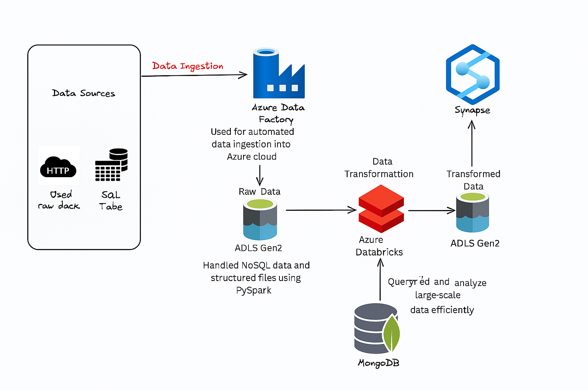
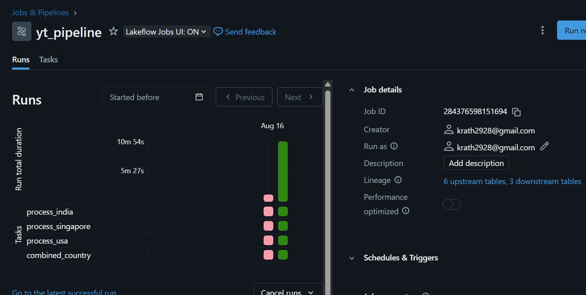
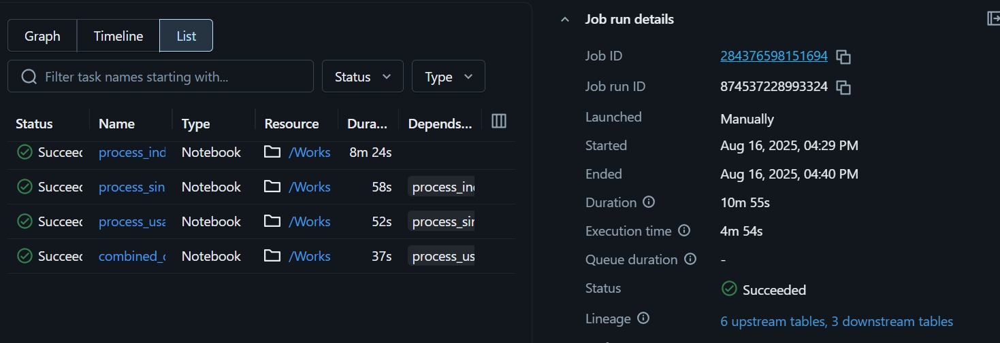
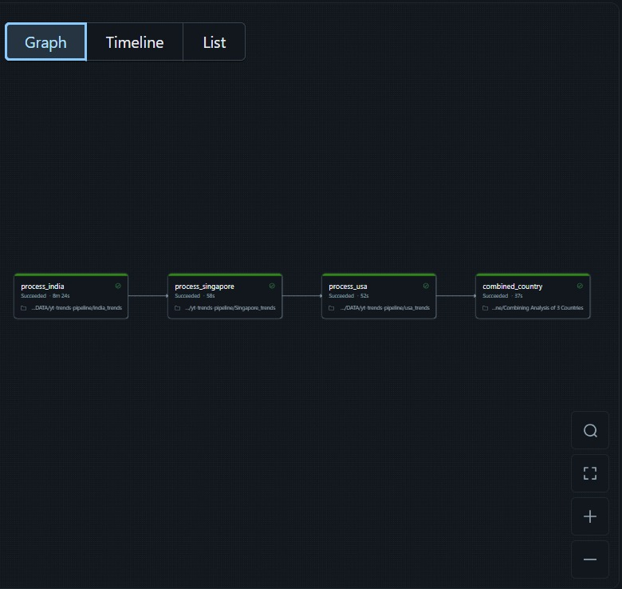

# 🌍 YouTube Video Trends: A Country-Wise Comparative Analysis

## ✅ Project Title
**"YouTube video trends country-wise using YouTube API JSON data and how digital content preference reflects tech awareness and education culture in each region."**

---

## 🎯 Goal / Objective
The objective of this project is to analyze and compare **YouTube video trends** across different countries (**India, USA, Singapore**) using YouTube API JSON data.  

By studying trending videos, the project explores:
- How digital content preferences vary across regions  
- What these preferences reveal about **tech awareness** and **education culture** in each country  

---


## ⚙️ Architecture Overview
The pipeline follows a **modern data engineering workflow**:

1. **Data Ingestion** → Fetch trending YouTube videos using the YouTube API and load into **MongoDB Atlas**.  
2. **Data Processing** → Use **Databricks (PySpark)** for cleaning, transformation, and feature engineering.  
3. **Data Storage** → Store the processed data in **Azure Data Lake (Delta format)** for scalability.  
4. **Analysis & Insights** → Perform trend analysis (likes, views, engagement) across countries.  
5. **Orchestration** → Use Databricks Jobs to automate ingestion & transformation pipelines.  

---
## 🛠️ Tech Stack
### 🔹 Programming & Frameworks
- **Python** (PySpark)
- **Databricks** (ETL + Analytics)
- **MongoDB** (Source Data)
- **Delta Lake** (Storage)

 ## ☁️ Cloud Exposure: Azure Data Engineering

Alongside the core project, I also implemented this pipeline on **Azure Cloud** to gain experience with enterprise data tools.

### Azure Architecture


**Key Components:**
- **Azure Data Factory** → Automated data ingestion from APIs & databases  
- **ADLS Gen2** → Stored raw and processed data in Azure Data Lake  
- **Azure Databricks** → PySpark-based transformations & Delta Lake storage  
- **MongoDB** → NoSQL data enrichment with JSON structures  
- **Azure Synapse** → Scalable querying & analytics  


---


# 🔄 Workflow / Pipeline

## Data Ingestion
- Fetch trending YouTube videos from YouTube API (JSON).
- Store raw data in MongoDB.

## Data Processing
- Extract JSON from MongoDB.
- Transform and clean using PySpark.
- Store structured datasets in Delta Lake for efficiency.

## Analysis
- Individual country-wise analysis (India, USA, Singapore).
- Combine results for cross-country comparative insights.

## Orchestration
Automated using Databricks Jobs with multiple tasks:
- process_india
- process_singapore
- process_usa
- combined_country
  
## save as
`casted_df.write.mode("overwrite").saveAsTable("processed_data.india_trending_processed")`

# 📊 Key Insights 
- **India:** Strong preference for entertainment & regional music.  
- **USA:** Higher representation of tech, vlogs, and gaming.  
- **Singapore:** Balanced mix of education, tech reviews, and lifestyle. 


 
## 🚀 How to Run

### 1. Clone the repository:
```bash
git clone https://github.com/subhakanta156/youtube_trends_pipeline.git
cd YouTube_Trends_Pipeline
```

### 2. Install dependencies:
```bash
pip install -r requirements.txt
```

### 3. Set up MongoDB connection:
 - Update the `mongo_config.py` file with your MongoDB URI and database details


## 📸 Screenshots

✅ Databricks Job Orchestration
  
  

✅ Successful run logs and execution timeline

  

✅ Graph view of tasks (India → Singapore → USA → Combined Analysis)

  

## 📌 Future Enhancements

- Add real-time streaming ingestion (e.g., Kafka → Delta Lake).
- Deploy interactive dashboard (Streamlit/PowerBI).
- Extend to more countries for broader cultural insights.

---

## ✨ Author

**Subhakanta Rath**  
_Data Engineering & AI Enthusiast_


 

